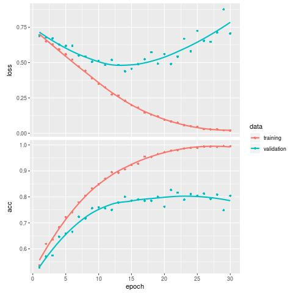
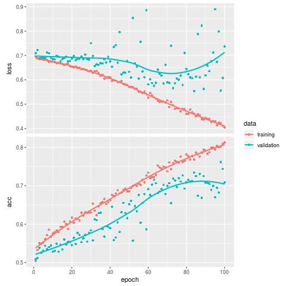
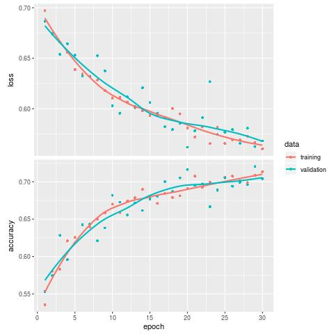
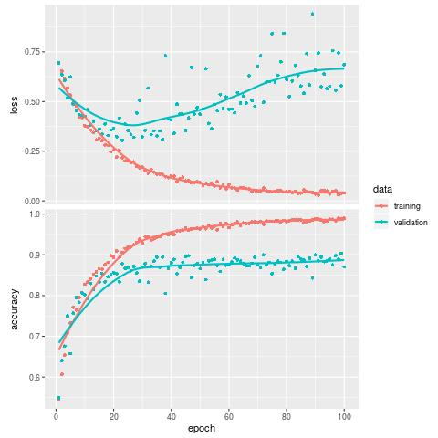

--- 
title: "Smart Data Project with Equancy"
author: "Hugo Brehier, Florentin Coeurdoux"
institute: 'ENSAI'
date: "19/02/2020"
fontsize: 8pt
output:
  beamer_presentation:
    theme: "Berkeley"
    colortheme: "seahorse"
    slide_level: 2
  powerpoint_presentation:
bibliography: [biblio.bib,packages.bib]
biblio-style: apalike
---


```{r include=FALSE}
knitr::opts_chunk$set(warning=FALSE, message=FALSE,echo=FALSE,fig.align="center",out.width='80%')
```

```{r include=FALSE}
knitr::write_bib(c('rvest',"keras",'plumber'), "packages.bib", width = 60)
```


<!--chapter:end:index.Rmd-->

# Introduction

## Initial problem

Our task involves the training of a classifier specialized in recognizing airplanes constructor and model type.
The idea is to put into practice our courses of Deep Learning, especially Convolution Neural Networks (CNN).
Indeed, these models have gained a lot of traction in the last decade or so, in computer vision, after setting
the best accuracy in classification contests, such as [**AlexNet on ImageNet**](https://mc.ai/paper-review-of-alexnet-caffenet-winner-in-ilsvrc-2012-image-classification/).
We will first look into classyfing Airbus and Boeing airplanes. Afterwards, we will delve into model types.
In modern fashion, the data used to train our models is scrapped from the website [**planespotters.net**](https://www.planespotters.net/).


## Trello
To manage the planning and monitoring of the various tasks throughout the project we organized ourselves thanks to a project management website : Trello.
  

{width=75%}

## Outline

In latter parts, we will describe the following points:

* the available data
* the methods and tools used
* the results obtained

The structure of our report will be as follow:

1. Website scrapping
2. Exploratory analysis
3. Classification through Deep Learning
4. Deploying to production

<!--chapter:end:01-intro.Rmd-->

# Web Scrapping

## What is Web Scraping?

Web scraping is a technique for converting the data present in unstructured format (HTML tags) over the web to the structured format which can easily be accessed and used.

Almost all the main languages provide ways for performing web scraping. To remain consistent in the same programming language we have chosen to use the R language for scraping the data from planespotters.net.

This website contains thousands of aircrafts pictures as well as the information about the constructor, the model and the airline for each different aircraft. Our aim is to extract all these informations.

## Website extraction

Fisrt we have to load the different libraries.

```{r echo=TRUE}
library(rvest)
library(dplyr)
library(stringr)
```

The R package rvest (@R-rvest) is a package that makes it easy to scrape data from html web pages, inspired by python libraries like beautiful soup. It is designed to work with magrittr so that you can express complex operations as  pipelines.

The **html_attr** function allows to extract attributes, text and tag name from html.

The website contains 125 pages and each pages contains 48 differents pictures of airplanes with descriptions.

## Scrapping code

Our website images extraction code extract all images of the website in addition with creating a dataframe with characteristics of the planes.

\tiny

```{r eval=FALSE,echo=TRUE}
aicrafts <- matrix(ncol = 3, nrow = 48*125)
nb <- 0
for (i in 1:125){
  nb <- nb+1
  planespotter_url <- paste("https://www.planespotters.net/photos/latest?page=",
                            i, sep = "")
  planespotter <- read_html(planespotter_url)
  img <- planespotter %>%
    html_node(xpath = '//*/img')
  
  imgalt <- html_attr(img, 'alt')
  imgsrc <- html_attr(img, 'src')
  imgsrc_split <- strsplit(imgsrc, "_")
  img_number <- as.integer(imgsrc_split[[1]][3])
  
  constructor_html <- planespotter %>%
    html_nodes(paste0('#', img_number, " a")) %>% 
    html_attr('href')
  
  constructor <- stringr::str_replace(constructor_html[4], "/photos/manufacturer/", "")
  aircraft_type <- stringr::str_replace(constructor_html[5],
                                        paste0('/photos/aircraft/',constructor, '/' ), "")
  airline <- stringr::str_replace(constructor_html[3], "/airline/", "")
  
  download.file(imgsrc, destfile = paste0('Images/',constructor, '.', nb, '.jpg'))
  aicrafts[(nb-co), 1] <- constructor
  aicrafts[(nb-co), 2] <- aircraft_type
  aicrafts[(nb-co), 3] <- airline
  
  for(j in 1:47) {
    nb <- nb+1
    img_numbera <- img_number - j
    node_id <- paste0('#', img_numbera, ' .photo__intrinsic_item')
    
    img <- planespotter %>%
      html_node(node_id) 
    
    constructor_html <- planespotter %>%
      html_nodes(paste0('#', img_numbera, " a")) %>% 
      html_attr('href')
    
    constructor <- stringr::str_replace(constructor_html[4], "/photos/manufacturer/", "")
    aircraft_type <- stringr::str_replace(constructor_html[5],
                                          paste0('/photos/aircraft/',constructor, '/'),"")
    airline <- stringr::str_replace(constructor_html[3], "/airline/", "")
      
    imgalt <- html_attr(img, 'alt')
    imgsrc <- html_attr(img, 'src')
    aicrafts[(nb-co), 1] <- constructor
    aicrafts[(nb-co), 2] <- aircraft_type
    aicrafts[(nb-co), 3] <- airline
    if(is.na(imgsrc)){ Sys.sleep(0.5)
    }else{
      download.file(imgsrc, destfile = paste0('Images/',constructor, '.', nb, '.jpg'))
    }
  }
}
aircrafts <- data_frame(constructor = aicrafts[,1], aircraft_type = aicrafts[,2], 
                        airline = aicrafts[,3])
write.table(aircrafts, file = "aicrafts.csv", append = T)
View(aircrafts)
length(list.files("Images/", pattern="jpg"))
dim(aicrafts)
```

<!--chapter:end:02-Web-Scraping.Rmd-->

# Exploratory Data Analysis
## First steps

```{r}
library(tidyverse)
```

The count of NA is :
```{r}
data <- read_csv(file = "aicrafts.csv", col_names = T)
sum(is.na(data$constructor))
```

Without NA, our data has the following size:

```{r}
data <- drop_na(data)
dim(data)
```

Unfortunately as you can see there is a lots of NAs in the scrapped data.

## Top constructor

```{r}
top_const <- data %>% group_by(constructor) %>% 
  summarise(count = n()) %>% 
  filter(count > 10)
```


```{r}
ggplot(top_const, aes(x = reorder(constructor, -count), y = count, fill = constructor)) +   geom_bar(stat = "identity") +
  theme(axis.text.x = element_text(angle = 45, hjust = 1)) +
  ggtitle("Most frequent constructors") +
  labs(y="frequency", x = "Constructors") +
  theme(plot.title = element_text(hjust = 0.5))
```

Airbus and Boeing are omnipresent.

## Top airlines 

```{r}
top_airlines <- data %>% group_by(airline) %>% 
  summarise(count = n()) %>% 
  filter(count > 30)
```


```{r}
ggplot(top_airlines, aes(x = reorder(airline, -count), y = count, fill = airline)) +        geom_bar(stat = "identity") +
  theme(axis.text.x = element_text(angle = 45, hjust = 1)) +
  ggtitle("most frequent airlines") +
  labs(y="frequency", x = "Airlines") +
  theme(plot.title = element_text(hjust = 0.5))
```

Unlike constructors the distribution of airlines is more homogeneous.

## All airlines 

```{r, warning=FALSE}
ggplot(data, aes(x = airline)) +       
  geom_histogram(stat="count") +
  labs(y="count", x = "Airlines") +
  theme(plot.title = element_text(hjust = 0.5),
        axis.text.x=element_blank(),
        axis.ticks.x=element_blank())

```

There is less disparity in airlines frequency.

## Proportion of model for Airbus

```{r}
top_airbus <- data %>%
  filter(constructor == "Airbus") %>% 
  group_by(aircraft_type) %>% 
  summarise(count = n()) 

```


```{r}
top_airbus <- top_airbus %>% filter(count > 20)

ggplot(top_airbus, aes(x = reorder(aircraft_type, -count), y = count, fill = aircraft_type)) +       
  geom_bar(stat = "identity") +
  theme(axis.text.x = element_text(angle = 45, hjust = 1)) +
  ggtitle("most frequent Airbus model") +
  labs(y="frequency", x = "Airbus model") +
  theme(plot.title = element_text(hjust = 0.5))
```

The most frequent Airbus is by far the A320-200.

## Proportion of model for Boeing 

```{r}
top_boeing <- data %>%
  filter(constructor == "Boeing") %>% 
  group_by(aircraft_type) %>% 
  summarise(count = n()) 
```

```{r}
top_boeing <- top_boeing %>% filter(count > 20)

ggplot(top_boeing, aes(x = reorder(aircraft_type, -count), y = count, fill = aircraft_type)) +       
  geom_bar(stat = "identity") +
  theme(axis.text.x = element_text(angle = 45, hjust = 1)) +
  ggtitle("most frequent Boeing model") +
  labs(y="frequency", x = "Boeing model") +
  theme(plot.title = element_text(hjust = 0.5))
```

There exist 30 different models of Boeing in our data.


<!--chapter:end:03-EDA.Rmd-->

# Deep Learning

## Overview

The fundamental idea which led to the development of CNN, is the idea that detecting an item in an image should trigger a response (neuron activation) without care for the position in the image of the item. Convolutions ,with filters invariant by translation across the image, follow this idea (@Mallat_2016).  
By using several convolutions in parallel and in succession, a network is able to learn some features of the data.
Classification is finally achieved by vectorizing the last layer which feeds a classical multilayer perceptron (MLP).

The first groundbreaking model is **AlexNet**, developed at the University of Toronto (@NIPS2012_4824).
It achieved first place at ImageNet image classification competition in 2012.

## AlexNet architecture


## AlexNet characteristics

It has many of the features still used today in popular applications.
Several techniques to achieve better results are widespread today :

* ReLU (Rectified Linear Unit) activation : $ReLU(x) = max(0,x)$
* Dropout of neurons : some neurons are arbritrarly deactivated
* ensembling several networks
* Data Augmentation : rotations, zooms of images
* Multiple GPUs computation of the backpropagation algorithm (@Rumelhart:1986we) .

For smaller projects, reusing already trained version of popular models on large datasets is also widespread, a technique named 'pretraining'.
It usually consists in keeping the convolution layers.

## Model

After several iterations, we have arrived at a model that uses some advanced techniques.
We use Keras (@R-keras) to implement it.
First, we load a pretrained version on ImageNet dataset of **VGG16, a CNN developed at Oxford** (@simonyan2014deep) .
It uses ReLU activation, as seen in AlexNet. 
It also uses small, 3 by 3 convolution filters (also named receptive fields), which have been widely adopted in recent years.
In comparison, AlexNet uses 11 by 11 receptive fields.

## Model

The training of VGG16 is based on logarithmic loss:
$$H_{y'} (y) := - \sum_{i} y_{i}' \log (y_i)$$
$y_i$ is the predicted probability value for class $i$ and $y_i'$ is the true probability for that class.

It is regularised by L2 weight decay :
$$\mbox{Loss}(w,x) = \mbox{RawLoss}(w,x) + \frac{1}{2} \,\, c \,\|w\|^2$$
On each optimization step in addition to stepping based on a gradient to better fit the training data, all model weights also decay proportionally towards zero by a small factor of $(1-\alpha c)$ , with $\alpha$ denoting the learning rate (gradient step).
The learning rate is also lowered as time passes, and filters are not initialized randomly.
Dropout (ratio of $0.5$) is used in fully-connected layers.

## Model {.allowframebreaks}

VGG16 structure is as follow.

\small
```{r}
library(keras)

conv_base <- application_vgg16(
  weights = "imagenet",
  include_top = FALSE,
  input_shape = c(150, 150, 3)
)

conv_base
```

## Model {.allowframebreaks}

We keep the convolution/pooling layers, already trained, and replace the fully connected layer with our own.
The last layer has a sigmoid activation to predict the constructor, either of Airbus or Boeing.


\small
```{r}

model <- keras_model_sequential() %>%
  conv_base %>%
  layer_flatten() %>%
  layer_dense(units = 256, activation = "relu") %>%
  layer_dense(units = 1, activation = "sigmoid")

model
```

## Model {.allowframebreaks}

Then, we unfreeze previously frozen layers. This means that some convolution/pooling layers (those after "block3_conv1") are going to be trained even though its
original use was to bring its already trained architecture.
This has shown to boost performance.

\small
```{r}
unfreeze_weights(conv_base, from = "block3_conv1")
model
```


## Model

We perform some data augmentation: rotation, zoom, horizontal flip.

```{r echo=TRUE}
train_datagen = image_data_generator(
  rescale = 1/255,
  rotation_range = 40,
  width_shift_range = 0.2,
  height_shift_range = 0.2,
  shear_range = 0.2,
  zoom_range = 0.2,
  horizontal_flip = TRUE,
  fill_mode = "nearest"
)
```

## Model

Skipping some technical details, we arrive at the training step. Here we use binary crossentropy (aka logarithmic loss) as a loss function.
Moreover, we store classification accuracy, the ratio of number of correct predictions to the total number of images classified.

$$Acc = \frac{TP + TN}{TP+TN+FP+FN}$$
where: TP = True positive; FP = False positive; TN = True negative; FN = False negative.

```{r echo=TRUE}
model %>% compile(
  loss = "binary_crossentropy",
  optimizer = optimizer_rmsprop(lr = 1e-5),
  metrics = c("accuracy")
)
```

## Model

Then we can train the model.
Here we used 100 epochs with 100 steps by epoch.


```{r echo=TRUE, eval=FALSE}
history <- model %>% fit_generator(
  train_generator,
  steps_per_epoch = 100,
  epochs = 100,
  validation_data = validation_generator,
  validation_steps = 50
)

```


## Performance check


We iterated over several models.
In the following images, we plot the logarithmic loss and the accuracy, on both the training and validation data for each of them.
First, we implemented our own convolution layers and fully connected layers.
In this model, we only use 30 epochs since we do not augment the dataset. Our loss reaches a minimum at around 15 epochs on the validation set.
The validation accuracy begins to decrease after 25 epochs.
The model achieves around 80% accuracy.


{width=50%}

## Performance check

After this first iteration, we then performed image augmentation, which allow us to use 100 epochs.
The validation loss reaches a minimum at around 80 epochs.
However, accuracy on the validation set decreased to 70%.


{width=50%}

## Performance check

At this point, we considered adding pretrained convolution layers from VGG16.
We only train the fully connected layers, thus we use 30 epochs.
Here, the validation and train loss are curiously intertwined.
The accuracy does not reach a plateau, and is of 70% at the last epoch.
  

{width=50%}

## Performance check

Lastly, we unfroze part of VGG16 convolution layers.
This is the model discussed in the previous part.
We resort to 100 epochs and observe a more classical loss, with the validation loss going up after 30 epochs while the training one continues downwards.
The validation accuracy finally reaches 88%, plateauing at 30 epochs with 85% but still slowing growing afterwards.

{width=50%}


<!--chapter:end:04-Deep-Learning.Rmd-->

# Production

## REST API with Plumber

Technically, API stands for Application Program Interface — a name that’s both exactly what an API is and too vague to actually convey any meaning. But what are API’s really? They’re a simple way to set up a computer to pass information to other computers through the internet. 95% of the time, when people say API they mean a RESTful API, which is an API that uses HTTP to interact with other computers. HTTP is the same protocol your browser is using for you to read websites. When you type in a URL to a website, a computer receives your request and sends back HTML. RESTful API’s are the same thing, but instead of HTML they send back text or data.

When you call an API you typically do one of two things. You either request that computer to send you a specific piece of information (like the weather of a certain city you requested), or you ask the other computer to change the data it has stored (like adding a record to a table). Most simply, API’s are ways to — from your computer — call a function on another computer.

The easiest way to create an API in R is using the library plumber (@R-plumber), a package which can convert existing R code into an API with just a few extra lines.


## REST API with Plumber

First, we create a script that loads the data and trains the model.

**runtime_functions.R**

```{r eval=FALSE,echo=TRUE}
library(keras)

model <- load_model_hdf5("plane-spotter_pretrained_fine_tuning.h5")

image_prediction <- function(path){
  image <- image_load(path, target_size = c(150,150)) %>% 
    image_to_array() %>% 
    array_reshape(c(1, 150, 150, 3))
  image_tensor <- image/255
  pred <- predict_classes(model, image_tensor)
  if(pred == 0){
    return("Airbus")
  } else{
    return("Boeing")
  }
}

image_prediction("Plumber/Boeing.5023.jpg")
```

The output is "Boeing"


## REST API with Plumber

Then we built the GET endpoint :

**rest_controller.R**

```{r eval=FALSE,echo=TRUE}
source("runtime_functions.R")

# Set an endpoint to return a pet name
#* @get /names
get_names <- function(){
  image_prediction("Plumber/Boeing.5023.jpg")
}
```

Here for the purpose of the exemple we predict a known image but the aim of the API is to get the image path as the input of the function.


## REST API with Plumber

Finally, we need to use plumber to set up our R code to accept HTTP requests and transform them into executable R code. 

We simply:

1. Import plumber.
2. Show plumber where our endpoints are.
3. Start the API service on port 80.
Since HTTP defaults to port 80, our service to that port allows things we type in our browser to be executed in the R on our computer.

**Main.R**

```{r eval=FALSE,echo=TRUE}
library(plumber)

r <- plumb("rest_controller.R")
r$run(port=80, host="0.0.0.0")
```

Great, now we can see the result of the output either by typing curl -X GET "http://127.0.0.1:6974/names" -H "accept: application / json" on the terminal or directly by going to http://127.0.0.1:6974/names in your browser.

## Docker

As a data scientist, we sometimes want to have code running in places that are not our computer. In our case, we want to have our R script run an API continuously, regardless of if our laptop runs out of battery.
One way we could set this up would be to create a virtual machine in a place like Amazon Web Services. A virtual machine is like a computer that you’ve used before, but it’s simulated–it doesn’t have it’s own process, memory, or hardware. Instead, a different computer is running the machine. Virtual machines are great because many of them can run on a single server, and they can be easily started and stopped.

Docker is a way to make the process of configuring and running computers smoother. With Docker, you can create a single document that specifies how to set up the computer. The document lets you run these steps at a moments notice. More formally, docker is a way to run virtual machines as containers, which are lightweight executable packages of software. A container is an instance of an image, which is a snapshot of a computer at a moment in time. Images can be full snapshots, or they can just be a small addition to an earlier image. A dockerfile is the specification document for how to build the image.

## Docker

So we try to use the API we created as the code we want in our docker container. We’ll start with an image already setup to have Linux on it. Then we’ll create an image that has R installed on top of Linux. After that, we’ll add our R libraries into a third image. Lastly, we’ll transfer our files to the final image.

A great thing about Docker is that since so many people use it, you can often find images that other people have made that do what you want to do. In our case, the Rocker project has a ton of Docker images that support R.
In order to build an image, Docker always looks for a plain text file with no extension called dockerfile.

To customize our docker container, we first specify our base container. For us, that’s the rocker/r-ver:3.5.0 image. We do this by using the `FROM` command. Then, we need to install the linux packages that are required for the plumber using linux bash commands. To these commands while setting up the image, we use the `RUN`. We then install python and the different usefull libraries, and `COPY` our code in the container.

And that’s our dockerfile! It builds everything we need to run our API from any machine, regardless of the setup!

## Docker {.allowframebreaks}

All together it looks like this:

```
FROM rocker/r-ver:3.6.0

# update some packages, including sodium and apache2, then clean
RUN apt-get update \
  && apt-get install -y --no-install-recommends \
    file \
    libcurl4-openssl-dev \
    libedit2 \
    libssl-dev \
    lsb-release \
    psmisc \
    procps \
    wget \
    libxml2-dev \
    libpq-dev \
    libssh2-1-dev \
    ca-certificates \
    libglib2.0-0 \
	libxext6 \
	libsm6  \
	libxrender1 \
	bzip2 \
	libsodium-dev \
    apache2 \
    zlib1g-dev \
    && wget -O libssl1.0.0.deb http://ftp.debian.org/debian/pool/main/o/openssl/libssl1.0.0_1.0.1t-1+deb8u8_amd64.deb \
    && dpkg -i libssl1.0.0.deb \
    && rm libssl1.0.0.deb \
    && apt-get clean \
    && rm -rf /var/lib/apt/lists/

# install miniconda, and set the appropriate path variables.
RUN wget --quiet https://repo.anaconda.com/miniconda/Miniconda3-4.6.14-Linux-x86_64.sh -O ~/miniconda.sh && \
    /bin/bash ~/miniconda.sh -b -p /opt/conda && \
    rm ~/miniconda.sh && \
    /opt/conda/bin/conda clean -tipsy && \
    ln -s /opt/conda/etc/profile.d/conda.sh /etc/profile.d/conda.sh && \
    echo ". /opt/conda/etc/profile.d/conda.sh" >> ~/.bashrc && \
    echo "conda activate base" >> ~/.bashrc
ENV PATH /opt/conda/bin:$PATH

# install tensorflow and h5py using the pip that links to miniconda (the default pip is for python 2.7)
RUN /opt/conda/bin/pip install --no-cache-dir tensorflow==2.0.0 h5py==2.10.0

# install Pillow to load a unique image
RUN /opt/conda/bin/pip install PIL
RUN /opt/conda/bin/pip install Pillow


# let R know the right version of python to use
ENV RETICULATE_PYTHON /opt/conda/bin/python

# copy the setup script, run it, then delete it
COPY src/setup.R /
RUN Rscript setup.R && rm setup.R

# copy all the other R files.
COPY src /src

EXPOSE 80

WORKDIR /src
ENTRYPOINT ["Rscript","main.R"]
```

## Docker

To build our image, open a terminal in the project folder and run
```` docker build -t r-tensorflow-api .```

And in order to run the container : 
```docker run --rm -it -p 80:80 r-tensorflow-api ```

If you want to have this web service running on a server in the cloud, it only takes a few more steps. One way to do this is to use a tool like Amazon Elastic Container Service (ECS). ECS lets you take a container you’ve created and deploy it to AWS. At that point your container is running within AWS systems, and you will get an endpoint that anyone can hit with a browser from anywhere.


<!--chapter:end:05-production.Rmd-->
# Conclusion
## Conclusion {.allowframebreaks}

Our final model achieves around 88% accuracy, on validation images, at binary classification of Airbus versus Boeing airplanes.

The next step would be to classify model types.
To do so, we could chain another CNN:

1. an image is classified under Airbus or Boeing by our binary CNN.
2. the image is then fed into either one of two models trained to recognize model types of Boeing or Airbus, respectively.

(e.g. if our first model outputs our image as Airbus, we feed the image in the Airbus model type CNN)
The output is the model of the airplane. To achieve this, we need to scrape the website again.
Sadly, the website [**planespotters.net**](https://www.planespotters.net/) was totally redesigned which made our scrapping code obsolete.

In the end, we achieved a reasonable objective to scrap a website to obtain data, explore the data, train a deep learning model, create an API and a docker image. 
We also obtained a CNN able to differenciate Airbus and Boeing airplaines.
Further advance would require rebuilding a scrapping tool.
Moreover, our dataset size of around two thousand images (not counting augmentation), is a bit limited.

In the computer vision community, several other methods are being developed which grow in popularity (@DBLP:journals/corr/GuWKMSSLWW15).
For example, stochastic gradient descent (or its relaxation to a few samples, minibatch) associated with batch normalization seem promising.
Inception modules also allow to reduce the number of parameters (reduced to 5 millions which are much less than AlexNet with 60 millions).
Residual Nets (ResNets) are also growing in popularity.


<!--chapter:end:06-conclusion.Rmd-->

## References {.allowframebreaks}

\bibliographystyle{apalike}
\bibliography{biblio,packages}


<!--chapter:end:07-references.Rmd-->

